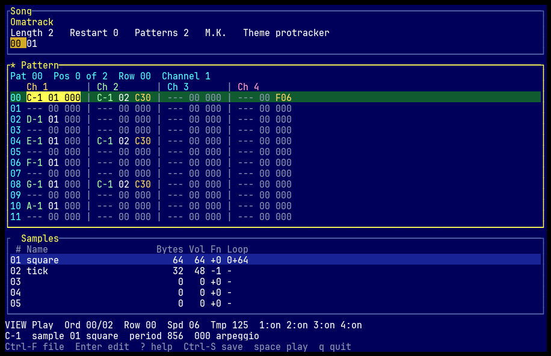
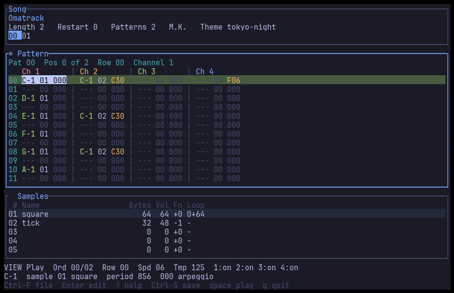
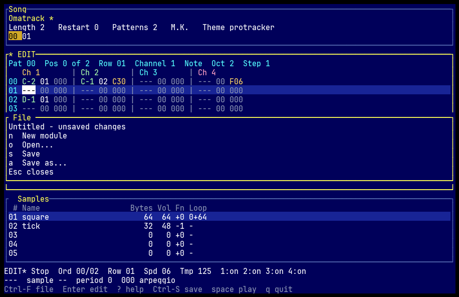
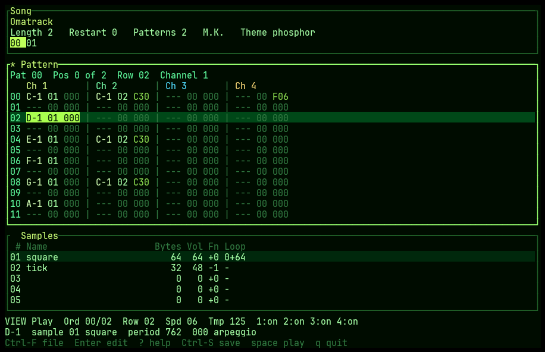

# Omatrack

Omatrack is a terminal music tracker for ProTracker `.mod`, FastTracker 2 `.xm`, and Impulse Tracker `.it`, written in Rust for [Omarchy](https://omarchy.org) Linux (Arch + Hyprland). It also runs in any terminal that can host a normal Rust binary.

It loads a 4-channel `.mod`, shows it, plays it, and edits it. It also loads and plays FastTracker 2 `.xm` and Impulse Tracker `.it` files (detected by header, not just by extension). Those songs are read-only: the pattern editor will not change them, and saving them is not supported yet, so the original file is left untouched. With no file it reopens the last module, or starts an empty one when there is nothing to reopen. Space starts playback from the cursor. Enter switches between browse and edit. The pattern highlight follows the song until you are editing. Ctrl-S writes the file back, and asks for a path when the module is still untitled. Ctrl-F is the file menu: new, open, save, and save as. A `*` after the title means the song has unsaved edits. Quit, new, and open ask before discarding them. The spectrum is up at launch, on the right of the sample list. F5 cycles that view, then a scope in the same pane, then off.

Colors follow the active Omarchy theme when one is installed. Otherwise the screen is the built-in ProTracker blue. `--theme` can force either of those, a green phosphor palette, or plain ANSI colors that track the terminal's own theme.





The pictures are the tracker buffer drawn with a monospace font. `cargo run --example screenshot -- out.cells pattern` writes the cells (`edit`, `help`, `file`, `phosphor`, `omarchy`, `viz`, and `scope` are the other views).

## Install

Rust 1.83 or newer is required. The committed `Cargo.lock` pins a few transitive crates so that compiler still builds. On Linux the audio backend is [cpal](https://docs.rs/cpal) through ALSA, which is also how PipeWire and PulseAudio expose an output. Building needs the ALSA headers (`libasound2-dev` on Debian and Ubuntu, `alsa-lib` on Arch).

### Cargo

```bash
cargo install --locked --path .
# or, once a release tag exists:
cargo install --locked --git https://github.com/dannyowelch/omatrack --tag v0.3.3
```

A tagged release also attaches `omatrack-x86_64-unknown-linux-gnu` to the GitHub release. Put that binary on `PATH`.

### Omarchy / Arch

The package recipe is `packaging/arch/PKGBUILD`. It builds the tagged release tarball (`v0.3.3`, the same version as `Cargo.toml`), not a git checkout. `sha256sums` is `SKIP` until that tag exists; replace it with the checksum of the release tarball after tagging. Install with:

```bash
cd packaging/arch
makepkg -si
```

That installs `/usr/bin/omatrack`, a desktop entry that opens a terminal, an icon, the example config at `/usr/share/omatrack/config.toml`, a man page (`man omatrack`), the README, and the MIT and Apache-2.0 license files. The desktop entry has `Terminal=true`, so the session terminal (Ghostty, Alacritty, or Kitty on Omarchy) is what launches it.

From a clone, without packaging:

```bash
cargo build --release --locked
./target/release/omatrack
```

## Build and run

```bash
cargo build --release
cargo run -- path/to/song.mod
cargo run -- path/to/song.xm
cargo run -- path/to/song.it
cargo run --                 # reopen the last module, or start empty
```

Copyrighted modules do not belong in the repo. The tests load freely licensed fixtures from `tests/data/` (CC0, public domain, CC BY 4.0, and BSD-3-Clause; see `tests/data/README.md` and `tests/data/ATTRIBUTION.txt`). Other `*.mod`, `*.xm`, and `*.it` paths stay gitignored. Generate a small original song and open it:

```bash
cargo run --example write_showcase -- /tmp/omatrack-showcase.mod
cargo run -- /tmp/omatrack-showcase.mod
```

Render that same song to a WAV file without opening a sound device. Playback stops when the song loops back on itself, or at `--max-seconds` (default 10 minutes), whichever comes first:

```bash
cargo run -- --render /tmp/omatrack-showcase.wav /tmp/omatrack-showcase.mod
```

`--rate`, `--interpolate linear|nearest`, and `--separation 0-100` apply to that render. `100` is hard Amiga panning (channels 1 and 4 left, 2 and 3 right). `0` is mono. The default interpolation is linear.

`OMATRACK_SOFTWARE_AUDIO=1` (also `true` or `yes`) plays inside the tracker without a sound device. The song is mixed on the UI thread and published to the spectrum on the same redraw timer as a live session. Nothing is opened through ALSA, PipeWire, or PulseAudio. It is for a machine with no output device, and for watching the analyzer; `--render` is still what writes a WAV.

`--help` prints the keys. `--version` prints the version. `?` inside the tracker lists them too. The view wants about 76 columns by 20 rows; 80×24 is comfortable. A smaller terminal says so instead of drawing a broken layout. Quitting, and a panic, both leave the terminal in its normal state.

```text
Enter            edit / browse
space            play / stop
Ctrl-R           rewind to order 0, row 0
?                key list
Ctrl-F           file menu: n new, o open, s save, a save as
Ctrl-S           save (save as, when the module is untitled)
Ctrl-Z / Ctrl-Y  undo / redo
q, Esc, Ctrl-Q   quit (asks when the song is modified)
Tab              pattern, samples, order
1 2 3 4          mute that channel (Alt-1..4 while editing)
Up/Down, j/k     move the cursor
Left/Right, h/l  change channel (pattern view)
F5               cycle visualization: spectrum, scope, off
PgUp/PgDn        page
Home/End         first or last row, or sample
[ ]              previous / next order position
, .              previous / next pattern
```

`Ctrl-R` rewinds to order 0, row 0. If the song is playing, it keeps playing from the start: channel voices, pattern loops, and the meters are cleared, so a note or a loop cannot keep running from the old position. If the song is stopped, the cursor moves to the start and playback stays stopped. `r` is not that key. In edit mode `r` is the upper-octave F#, and on the sample list `r` renames the instrument. Text entry, the file menu, and the other prompts ignore `Ctrl-R`.

`q` quits from browse mode. `Ctrl-Q` quits from anywhere, including edit mode. `Esc` clears a block, then leaves edit mode, then quits. `Ctrl-C` copies; it does not quit. New and open, from the file menu, ask the same question as quit when the song is modified: `y` saves first, `n` discards, `Esc` cancels. Saving an untitled module opens the path picker. Cancelling that picker cancels the quit, new, or open that was waiting on it.



### Configuration

`~/.config/omatrack/config.toml`, or `$XDG_CONFIG_HOME/omatrack/config.toml` when that variable is set. `--config` points somewhere else. A missing file uses the defaults. A file that is not valid for the small TOML subset this program reads is ignored, and the reason is shown on the status line; omatrack still starts. A bad value keeps that setting's default and keeps the rest of the file. Unknown keys are ignored. The example, which is also what the package installs, is `packaging/config.toml`:

```toml
reopen_last = true
default_view = "spectrum"
theme = "auto"

[audio]
sample_rate = 44100
interpolation = "linear"
stereo_separation = 100
max_seconds = 600

[edit]
octave = 2
step = 1
```

`--rate`, `--interpolate`, `--separation`, and `--max-seconds` override the audio section for `--render`. Live playback asks the device for `sample_rate` and uses the device's own rate when it cannot play that one. Interpolation and stereo separation still apply. Sample audition stays centered.

`reopen_last` (default `true`) loads the last module when the command line does not name one. `--no-reopen` skips that for one launch. A file argument always wins. The path is not stored in this file: it lives at `$XDG_STATE_HOME/omatrack/last_file`, or `~/.local/state/omatrack/last_file`. Open, save, and save as update it. New clears it. A missing, unreadable, or invalid remembered file starts an empty module and puts a short reason on the status line.

`default_view` is `spectrum`, `scope`, or `off`. The default is `spectrum`. F5 still cycles spectrum, scope, off. The spectrum or the scope sits on the right half of the sample row. `off` hides that pane and lets the sample list use the full width. The pattern, including the meters under its columns, stays up in every mode.

### Themes

How the palette is found, from the current Omarchy tree (`docs/theming.md` and `bin/omarchy-theme-set` / `bin/omarchy-theme-color` in [basecamp/omarchy](https://github.com/basecamp/omarchy)):

- A theme starts as `colors.toml`. `omarchy-theme-set` copies it, renders terminal configs from templates, and publishes the result.
- Current Omarchy puts that directory at `~/.local/state/omarchy/current/theme` (`$XDG_STATE_HOME/omarchy/current/theme` when the variable is set) and writes the theme's name to the sibling `theme.name`.
- Older `omarchy-theme-set` published the same directory at `~/.config/omarchy/current/theme`.
- `colors.toml` is the canonical palette: `background`, `foreground`, `accent`, `muted`, `bright_foreground` (the cursor; there is no separate cursor key), `selection`, and named colors such as `red` and `green`. Legacy short names (`bg`, `fg`, …) and ANSI `color0`–`color15` still resolve. The alias order matches `omarchy-theme-color`.
- A theme that predates `colors.toml` may only have a rendered terminal config. Omatrack then reads `alacritty.toml`, `kitty.conf`, or `ghostty.conf` from that same directory.

`--theme auto` (the default) uses that palette and falls back to ProTracker blue when none of those directories have one. `--theme omarchy` is the same read, and it says so when it has to fall back. `--theme protracker` and `--theme phosphor` are built in and do not touch the disk. `--theme terminal` uses ANSI colors, so a terminal that is already themed paints omatrack with that palette.



Roles: background and foreground are the theme's own. The cursor is `bright_foreground` on the background, which is what Omarchy's terminal templates use. Edit mode uses the accent, so it stays distinct from that cursor. The playback row mixes the background toward green. Channel headers, and the meters under them, are red, yellow, green, and blue, repeating every four channels. The waveform and the spectrum bars are cyan. Spectrum bars have no peak caps. Errors are red.

Truecolor (`ESC[38;2;…m`) is used when `COLORTERM` is `truecolor` or `24bit`, or when `TERM` names kitty, alacritty, or ghostty. A 256-color `TERM` gets the xterm cube. Anything else, including a dumb terminal, gets the 16 ANSI colors. `OMATRACK_COLOR=truecolor|256|16` overrides that. Named ANSI colors, including the whole `terminal` theme, are left as indexes so they keep tracking the terminal.

`SIGUSR1` reloads the palette (`kill -USR1` the process). So does a change to the theme file, the theme directory, or `theme.name`, which is what an atomic `omarchy-theme-set` swap looks like. The check is a `stat` each frame.

`[ ]` follows the order list and changes the pattern you see. `,` `.` walks patterns directly, including ones the current order position does not point at. While the song is playing, and you are not editing, the view follows the playhead: the current row is green, and the transport bar shows order, row, speed, and tempo. `Ctrl-R` sends that playhead back to order 0, row 0 without stopping it. The same key, while stopped, only moves the cursor.

Notes use ProTracker octave numbers (`C-1` is period 856, not `C-4`). Sample numbers in the pattern are decimal `01`–`31`. The loop column is `start+length` in bytes, and `-` means the sample does not loop.

### Editing

Enter turns on edit mode. The pattern pane is labeled `EDIT`, the transport says `EDIT`, and the cursor sits on one field of the cell: note, sample tens, sample ones, effect command, parameter high, parameter low. Left and right move between those fields and across channels. Up and down move rows. Tab and Shift-Tab move a channel at a time. `hjkl` stay as movement keys in browse mode; in edit mode `h` and `j` are notes.

The piano is the ProTracker layout. The lower row plays the current octave. The upper row plays the octave above. F1 and F2 change the octave (1–3, so the upper row is silent on octave 3). F3 and F4 change the edit step (0–16). A note writes that period and the current sample (the one selected in the sample list) and moves down by the step. The effect on the cell is left alone. The note is previewed through the playback engine when the song is stopped.

```text
upper   Q 2 W 3 E R 5 T 6 Y 7 U     octave + 1
        C C#D D#E F F#G G#A A#B

lower   Z S X D C V G B H N J M     current octave
        C C#D D#E F F#G G#A A#B
```

Sample digits are decimal, because the column shows `00`–`31`. Effect command and parameter digits are hex. Typing the parameter's low digit moves down by the edit step and returns to the note.

Delete on the note clears the whole cell. Delete on a digit clears that digit. Backspace clears the cell one step up (the current cell when the step is 0) and moves there. Insert pushes the current channel down. Ctrl-Backspace pulls it up. Ctrl-Insert and Ctrl-Delete do the same for every channel.

Ctrl-B starts a block at the cursor; moving the cursor grows it, and Ctrl-B again clears it. Ctrl-A selects the pattern. Ctrl-C copies, Ctrl-X cuts, Ctrl-V pastes at the cursor. Alt-Up and Alt-Down transpose by a semitone. Alt-Left and Alt-Right transpose by an octave. Notes that are not in the ProTracker period table are left alone, and the ends of C-1..B-3 clamp. Alt-K clears the channel. Alt-P clears the pattern. With no block marked, copy, cut, and transpose use the current cell. Ctrl-C copies; it does not quit.

The order pane (Tab until the song header is focused) edits the order list. Up and Down change the pattern number at the cursor. Insert and Delete insert and remove an entry. `+` and `-` change the song length. `N` appends an empty pattern and points the current entry at it. Past 64 patterns an `M.K.` tag becomes `M!K!`.

Ctrl-T edits the title. On the sample list, `R` renames the current sample. Enter stores the text, Esc cancels. Names are Latin-1, 20 bytes for the title and 22 for a sample.

Every edit is one undo step, with no depth cap. Undo and redo restore pattern cells, the order list, pattern count, the tag, the title, sample names, and the sample itself (PCM, loop, volume, finetune). Saving uses the same writer as the loader. Edit, save, and load again returns the edited module. Undoing back to the last save clears the `*`.

### Samples

On the sample list, `R` still renames the instrument. The other sample keys are only active on that pane, so they do not collide with edit-mode notes (`z` is a note while editing, and a fade on the sample list).

```text
i                import a WAV into this slot
o                export this sample as 8-bit mono WAV
Ctrl-G           render the song (same mix as --render)
v / f            volume / finetune
l                loop start and length, in bytes
/                toggle the loop
t                trim to start..end (end exclusive, even bytes)
n                peak-normalize
w                reverse (R stays rename)
a / z            fade in / fade out
c                clear the PCM and the loop
y                copy this sample onto another slot
p                preview at the note chosen with - and =
u                undo, the same stack as Ctrl-Z
```

Import asks for a path (type one, or move through the directory list) and then how to resample. The default base note is C-2: the WAV is resampled to the Amiga rate of that note and finetune, so playing C-2 reproduces the original pitch. `n` toggles peak normalize, `d` toggles triangular dither, and `r` types a rate in hertz instead. Stereo is averaged to mono. 8, 16, and 24-bit PCM and 32-bit float are accepted, including `WAVEFORMATEXTENSIBLE`. A missing file stays on the picker. An unsupported encoding is reported and does not change the slot. Samples longer than 131070 bytes are cut, and that truncation stays on the status line. The stored length is always even.

Export writes unsigned 8-bit mono at the sample's C-2 playback rate, or at a rate you type (Tab moves to the rate field). `p` auditions the sample through the same mixer as note preview, centered, for a few seconds. The sample list draws a one-line waveform with `|` at the loop points.

If no output device can be opened, the tracker stays up and the transport bar names PipeWire, PulseAudio, and ALSA. `--render` never touches the device. A device that cannot play the configured sample rate keeps its own rate.

## Visualization

The tracker opens on the spectrum. F5 cycles three views: the spectrum beside the sample list, a scope in that same pane, then off, then the spectrum again. The same key works while editing. The transport bar says `Viz` or `Scope` while one is up. `default_view` in the config file selects the startup view. Off gives the sample list the full width. The pattern stays on screen in every mode.

Each pattern column has its own volume meter on a one-row strip along the bottom of the pattern pane. The meter is that channel's peak `|sample × volume|` over the latest mix window, drawn as a horizontal block bar in the channel color, so a mute or a volume of 0 stays on the baseline. The strip uses the same column spacing as the pattern. When an XM or IT song has more channels than fit, the meters scroll with the visible columns. A `.mod` shows four meters, one under each channel. The meters stay up while the spectrum is hidden.

The spectrum pane shares the sample list's height, on the right half of that row. It draws a log-spaced spectrum of the final stereo mix (mono average, Hann window, 512-point FFT) with Unicode block bars and no peak caps. Bars rise quickly and fall on a clock, not a frame count. The scope, when F5 selects it, uses that same right-hand pane: a braille canvas (U+2800) with a Lissajous trace of the stereo mix and four diamonds, one per channel, that grow and orbit with that channel's level. It repaints with the UI, about 30 frames per second while it is the thing on screen and playback is stopped, and with the playhead while a song is running.

The audio callback never waits on the UI. It publishes a fixed window of the mix and the four peaks through atomics. The FFT, the bar smoothing, and the braille drawing run on the UI thread. `--render` does not draw either view. The same analysis functions are what the unit tests call.

## Playback

The mixer lives in `player` and does not open an audio device. `Playback::render` fills an interleaved stereo `i16` buffer from a `Module` and the current voice state, so tests and `--render` hear exactly what the callback plays.

Timing is the PAL CIA clock. Speed is ticks per row (default 6). Tempo is the `Fxx` BPM value (default 125, which is 50 ticks per second). Pitch is `3_546_895 / period` samples per second. A cell stores the finetune-0 period; the channel's finetune (from the sample, or from `E5x` for the next note) selects the ProTracker period table.

Slides, vibrato, arpeggio, tremolo, volume slides, retrigger, and note cut run after the first tick of the row. Notes, sample offset, jumps, breaks, fine slides, and speed/tempo run on the first tick. A zero parameter repeats the last value for slides, portamento, vibrato, tremolo, volume slides, retrigger, offset, and the fine slides.

| Command | What it does |
| --- | --- |
| `0xy` | Arpeggio |
| `1xx` `2xx` | Slide up / down, clamped to periods 113–856 |
| `3xx` | Tone portamento, without retriggering the sample |
| `4xy` | Vibrato |
| `5xy` | Tone portamento and volume slide |
| `6xy` | Vibrato and volume slide |
| `7xy` | Tremolo |
| `9xx` | Sample offset, `xx * 256` bytes |
| `Axy` | Volume slide |
| `Bxx` | Position jump |
| `Cxx` | Set volume, clamped to 64 |
| `Dxx` | Pattern break. The parameter is two decimal digits |
| `E1x` `E2x` | Fine slide up / down |
| `E3x` | Glissando on or off |
| `E4x` `E7x` | Vibrato / tremolo waveform (sine, ramp, square; bit 2 keeps the phase) |
| `E5x` | Set finetune. The note on this row keeps the previous finetune |
| `E6x` | Pattern loop. `E60` sets the start; `E6n` plays the section `n + 1` times |
| `E9x` | Retrigger |
| `EAx` `EBx` | Fine volume up / down |
| `ECx` | Note cut on tick `x` |
| `EDx` | Note delay until tick `x` |
| `EEx` | Pattern delay, `x` extra passes over the row |
| `Fxx` | `00` stops. `01`–`1F` sets speed. `20`–`FF` sets tempo |

These are ignored. The row still advances:

| Command | Why |
| --- | --- |
| `8xx` | Not a ProTracker command. Panning stays the Amiga hard pan |
| `E0x` | Amiga LED filter. There is no analogue filter here |
| `E8x` | Unused in ProTracker |
| `EFx` | Invert loop. It rewrites the sample while it plays |

Channels 1 and 4 are left, 2 and 3 are right. Mute keeps the effect running and only drops that channel's samples.

## Checks

```bash
cargo fmt --check
cargo clippy --all-targets --all-features -- -D warnings
cargo test --all-targets --all-features
```

GitHub Actions runs those three on Rust 1.83, after installing the ALSA headers cpal needs to build.

## FastTracker 2 and Impulse Tracker

`.xm` is recognized by the `Extended Module: ` magic. `.it` is recognized by `IMPM`. Ctrl-F's file list also shows `.xm` and `.it`. Reopening the last file works for both.

Playback covers the usual song: more than four channels (XM up to 32, IT up to 64), real panning from the file, 8-bit and 16-bit samples, forward and ping-pong loops, XM volume and panning envelopes, auto-vibrato, linear and Amiga frequency tables, and the standard XM effect set (arpeggio, slides, tone portamento, vibrato, tremolo, volume-column effects, pattern break and jump, speed and tempo, retrigger, note cut and delay). IT playback covers instruments or sample mode, basic NNA and duplicate-check actions, volume, pan, and pitch envelopes, sustain loops, linear and Amiga slides, and the common effects (`A` speed, `B` jump, `C` break, `D` volume slide, `E`/`F` portamento, `G` tone portamento, `H` vibrato, `J` arpeggio, `K`/`L`, `O` offset, `Q` retrigger, `S` extended, `T` tempo, `V` global volume, `X` panning, and the related column commands). IT214 and IT215 compressed samples are decompressed. A stereo compressed sample is refused with an error instead of being played as noise.

The pattern view scrolls sideways when the song has more channels than the screen. Cells are compact (`C-401--C00` style, with the volume column). A volume meter sits under each visible column and scrolls with it, including songs with 32 or 64 channels. The spectrum stays on the right of the sample list and does not grow a meter gutter. The scope still draws four shapes from the first four channels.

Editing and saving stay `.mod` only. Enter on an XM or IT song says the song is read-only. Ctrl-S and Save As do not overwrite the file. There is no Save As `.mod`: a conversion would drop extra channels, instruments, and envelopes. Ctrl-G and `--render` still write a WAV.

Not implemented, on purpose: IT resonant filters, stereo IT214 samples, MIDI macros (`Zxx`), and bit-exact FastTracker 2 / Impulse Tracker output. Envelopes, auto-vibrato, and slides follow the published period formulas and the usual tick rules; a few tracker-specific quirks (exact FT2 vibrato tables, old-IT effect compatibility, filter envelopes) are approximated or skipped. The song stays in time when an effect is skipped.

## What `.mod` files are supported

31-sample, 4-channel ProTracker modules:

| Tag | Where it shows up |
| --- | --- |
| `M.K.` | ProTracker |
| `M!K!` | ProTracker with more than 64 patterns |
| `FLT4` | Startrekker 4-channel |
| `4CHN` | generic 4-channel |

The reader and writer share one layout: 20-byte title, 31 × 30-byte sample headers (name, length in words, finetune, volume, loop start, loop length), song length, restart byte, 128-byte order list, the tag, then 64×4 patterns and signed 8-bit sample data.

Pattern count is `max(order) + 1` over all 128 order bytes, including slots past the song length. That is the ProTracker rule, and it is what makes `parse` then `write` return the same bytes. Names, the restart byte, finetune bits above the low nibble, volumes above 64, and any suffix after the samples are kept. Cells that do not fit the bit fields (period wider than 12 bits, effect wider than 4 bits) are rejected on write rather than silently truncated.

A short file, a bad tag, or a song length outside `1..=128` returns an error. 15-sample modules and 2/6/8-channel tags are not this format and are rejected. Tests synthesize modules and also round-trip the fixtures in `tests/data/`. Do not commit copyrighted `.mod` files.

## Layout

`omatrack` is a library and a binary. The binary is a thin command-line wrapper so the format code and the mixer can be tested without a terminal or a sound card.

```text
src/lib.rs        library root
src/main.rs       arguments, exit codes, terminal startup
src/config.rs     ~/.config/omatrack/config.toml
src/state.rs      last-opened module path
src/omarchy.rs    active Omarchy palette
src/module.rs     Module, Pattern, Cell, Sample
src/modfile.rs    .mod parser and writer
src/notes.rs      finetune-0 period table and effect names
src/edit.rs       note entry, blocks, song edits, the one undo stack
src/convert.rs    WAV PCM to signed 8-bit mono
src/sample_edit.rs volume, loop, trim, fades, copy
src/waveform.rs   block waveform for the sample list
src/player/       tick clock, effects, four-channel mixer
src/track/        XM and IT loaders and their replayer
src/viz/          FFT, meters, lock-free mix window, braille scope
src/audio.rs      cpal output and note/sample preview
src/wav.rs        WAV reader, 16-bit stereo writer, 8-bit mono writer
src/demo.rs       the original showcase module
src/error.rs
src/tui/          cursor, keys, sample prompts, colors
packaging/        PKGBUILD, desktop entry, man page, example config
```

`Module` is the document. The TUI borrows it and keeps view state (which row, which channel, which order position). [`edit::Editor`](src/edit.rs) is the only undo stack: pattern cells, the order, the title, sample names, and sample PCM all push entries there. The replayer borrows the module and keeps the voices. Preview, of a typed note or of `p` on a sample, uses that mixer.

| Milestone | What it adds | Where it lives |
| --- | --- | --- |
| M1 | `.mod` load/save model, tracker view | this tree |
| M2 | 4-channel mixer, Amiga periods, effects, PipeWire/ALSA via cpal | `player`, `audio`, `wav` |
| M3 | note entry, copy/paste, undo, ProTracker-style keys | `edit` |
| M4 | WAV import/export and sample editing on that same undo stack | `convert`, `sample_edit`, the sample pane |
| M5 | Omarchy theme, config file, Arch `PKGBUILD`, file menu | `omarchy`, `config`, `packaging/` |
| M6 | Reopen the last module; spectrum, meters, and scope | `state`, `viz`, the audio callback |

Ctrl-S writes the module with the same writer the round-trip tests use.

## License

Omatrack is MIT or Apache-2.0, at your option. See `LICENSE-MIT` and `LICENSE-APACHE`.

The modules in `tests/data/` are fixtures and are not under those licenses. Each one keeps the license named in `tests/data/ATTRIBUTION.txt` (CC0, public domain, CC BY 4.0, and BSD-3-Clause), including the XM and IT fixtures. Do not commit copyrighted module files.
