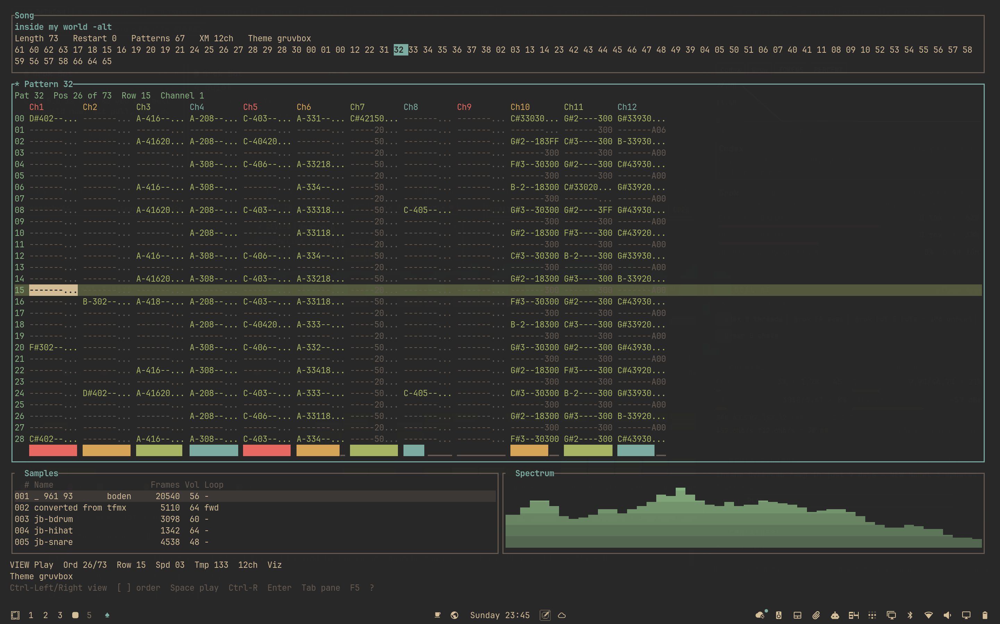
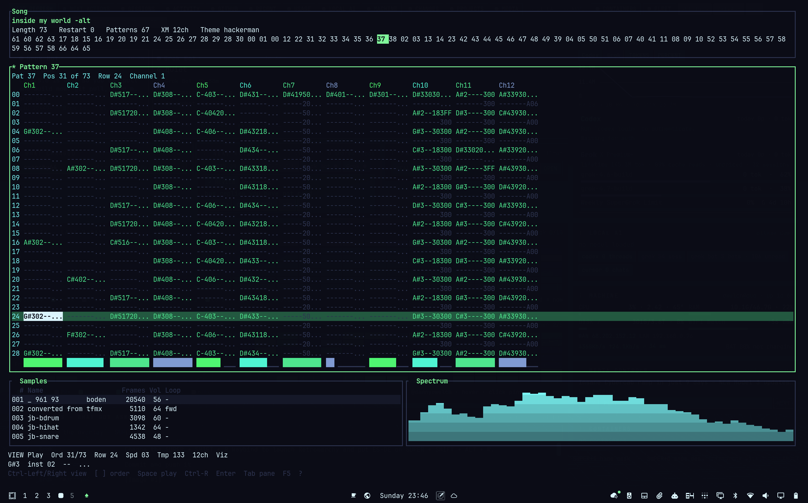
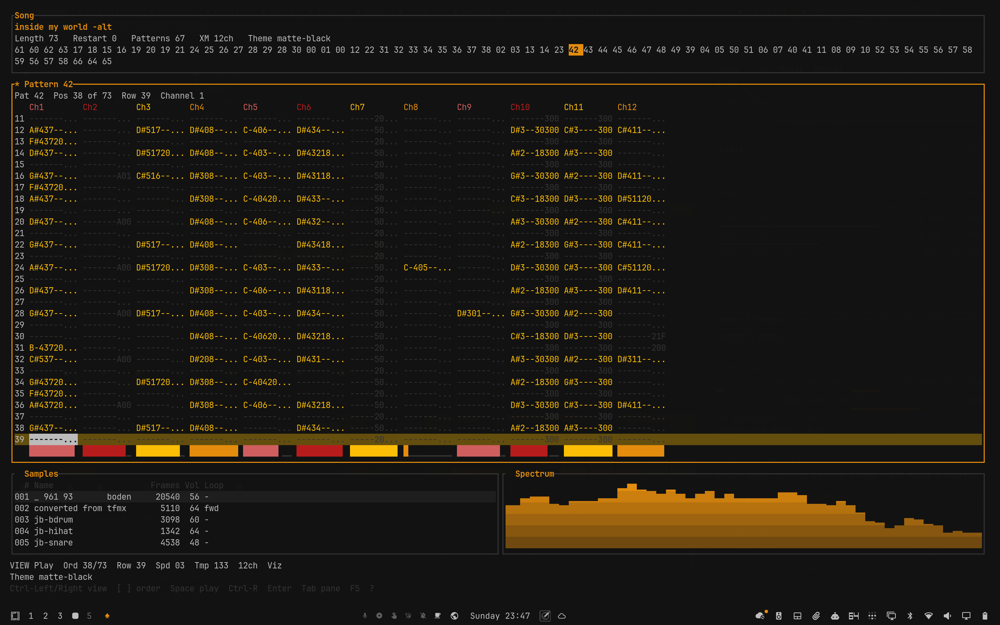

# Omatrack

Omatrack is a terminal music tracker for ProTracker `.mod`, FastTracker 2 `.xm`, and Impulse Tracker `.it`, written in Rust for [Omarchy](https://omarchy.org) Linux (Arch + Hyprland). It also runs in any terminal that can host a normal Rust binary.



*gruvbox*

| hackerman | matte-black |
| --- | --- |
|  |  |

The song header's **Theme** line is the active Omarchy theme (`theme.name`). gruvbox, hackerman, and matte-black are themes Omarchy has published; omatrack paints with that palette. `--theme` can also force ProTracker blue, the green phosphor palette, or the terminal's own ANSI colors.

It loads, plays, edits, and saves all three formats. The format comes from the header (`M.K.` / `M!K!` / `FLT4` / `4CHN`, `Extended Module: `, or `IMPM`), not only from the extension. Ctrl-S writes the open file's own format. Save As chooses `.mod`, `.xm`, or `.it` from the extension and names anything the conversion had to drop. With no file it reopens the last module, or starts an empty one when there is nothing to reopen.

A `.mod` is 4 channels. An `.xm` can have up to 32, an `.it` up to 64, and the pattern view scrolls when more columns are on screen than fit (the pictures above are a 12-channel XM). Each visible column has its own volume meter. F5 cycles a spectrum, a scope, and off. Undo and redo cover the song. Samples can be edited and imported or exported as WAV. `--render out.wav` mixes the song without opening a sound device.

Space starts playback from the cursor. Enter switches between browse and edit. While the song is playing and you are browsing, the highlight follows the playhead. A `*` after the song title means unsaved edits. Quit, new, and open ask before discarding them. The focused pane is the one whose title starts with `*`. The bottom row lists shortcuts for that pane and drops the ones that do not fit.

## Install on Omarchy / Arch

There is no AUR package. The recipe is `packaging/arch/PKGBUILD`. It builds the tagged GitHub release tarball named in that file (`v0.5.0`, the same version as `Cargo.toml`), not the files in your clone. `sha256sums` is the checksum of `https://github.com/dannyowelch/omatrack/archive/refs/tags/v0.5.0.tar.gz`. `makepkg` downloads that tarball, so the machine needs network access during the build.

Runtime dependencies (`depends`): `alsa-lib`, `gcc-libs`, `glibc`. Build dependencies (`makedepends`): `rust`, `cargo`. `makepkg` itself comes from `base-devel`. Optional (`optdepends`): `ghostty`, `alacritty`, or `kitty`, because the desktop entry has `Terminal=true` and opens in the session terminal.

```bash
git clone https://github.com/dannyowelch/omatrack.git
cd omatrack/packaging/arch
makepkg -si
```

That installs `/usr/bin/omatrack`, the desktop entry `/usr/share/applications/omatrack.desktop` (what the Omarchy launcher shows), the icon `/usr/share/icons/hicolor/scalable/apps/omatrack.svg`, the example config at `/usr/share/omatrack/config.toml`, a man page (`man omatrack`), the README, and the MIT and Apache-2.0 license files.

## Update

```bash
cd omatrack
git pull
cd packaging/arch
makepkg -si
```

A pull changes what gets installed when the pulled `PKGBUILD` points at a new tag (`pkgver` and `sha256sums`). The recipe still builds that tag's GitHub tarball, not your working tree.

`makepkg` extracts each version into its own `src/omatrack-$pkgver` directory, so an older version's `src/` and `pkg/` are left unused. Two cases need a clean rebuild:

- makepkg says a package has already been built (same `pkgver` and `pkgrel`). Rerun with `makepkg -si --force`.
- The checksum of the same tag tarball changed, or makepkg reports that a file failed the validity check. Delete the downloaded `omatrack-*.tar.gz` next to the PKGBUILD (makepkg keeps that file and will not re-download it), then run `makepkg -si --cleanbuild`. `--cleanbuild` removes `src/` before building. It does not delete the downloaded tarball.

## Uninstall

```bash
sudo pacman -R omatrack
```

The package name is `omatrack`. That removes the binary, the man page, the example config, the icon, and `/usr/share/applications/omatrack.desktop`, so the Omarchy menu entry goes with it.

pacman leaves the files the program writes for you. There is no cache directory. Configuration is `~/.config/omatrack/` (`$XDG_CONFIG_HOME/omatrack/` when that variable is set), usually `config.toml`. The last opened path is `$XDG_STATE_HOME/omatrack/last_file`, or `~/.local/state/omatrack/last_file`. Remove them with:

```bash
rm -rf "${XDG_CONFIG_HOME:-$HOME/.config}/omatrack"
rm -rf "${XDG_STATE_HOME:-$HOME/.local/state}/omatrack"
```

## Other Linux / from source

Rust 1.83 or newer. The committed `Cargo.lock` pins a few transitive crates so that compiler still builds; `--locked` uses it, which is also what CI and the release workflow use. On Linux the audio backend is [cpal](https://docs.rs/cpal) through ALSA, which is also how PipeWire and PulseAudio expose an output. Building needs the ALSA headers (`libasound2-dev` on Debian and Ubuntu, `alsa-lib` on Arch).

```bash
cargo install --locked --path .
# or
cargo build --release --locked
./target/release/omatrack
```

`cargo install` puts the binary in `~/.cargo/bin`. From a clone without installing:

```bash
cargo run -- path/to/song.xm
```

A tagged release also attaches `omatrack-x86_64-unknown-linux-gnu` to the GitHub release (the `v*` workflow builds it and uploads it). Put that binary on `PATH`. It is a glibc build and needs `alsa-lib` at runtime, the same as the Arch package.

```bash
cargo install --locked --git https://github.com/dannyowelch/omatrack --tag v0.5.0
```

## Run

```bash
cargo run --release -- path/to/song.mod
cargo run --release -- path/to/song.xm
cargo run --release -- path/to/song.it
cargo run --release --                 # reopen the last module, or start empty
```

Copyrighted modules do not belong in the repo. The tests load freely licensed fixtures from `tests/data/` (CC0, public domain, CC BY 4.0, and BSD-3-Clause; see `tests/data/README.md` and `tests/data/ATTRIBUTION.txt`). Other `*.mod`, `*.xm`, and `*.it` paths stay gitignored. Generate a small original song and open it:

```bash
cargo run --example write_showcase -- /tmp/omatrack-showcase.mod
cargo run -- /tmp/omatrack-showcase.mod
```

Render that song to a WAV file without opening a sound device. Playback stops when the song loops back on itself, or at `--max-seconds` (default 10 minutes), whichever comes first:

```bash
cargo run -- --render /tmp/omatrack-showcase.wav /tmp/omatrack-showcase.mod
```

`--rate`, `--interpolate linear|nearest`, and `--separation 0-100` apply to that render. `100` is hard Amiga panning (channels 1 and 4 left, 2 and 3 right). `0` is mono. The default interpolation is linear. Inside the tracker, Ctrl-G writes the same mix.

`OMATRACK_SOFTWARE_AUDIO=1` (also `true` or `yes`) plays inside the tracker without a sound device. The song is mixed on the UI thread and published to the meters and the spectrum on the same redraw timer as a live session. Nothing is opened through ALSA, PipeWire, or PulseAudio. `--render` is still what writes a WAV.

`--help` prints the keys. `--version` prints the version. `?` inside the tracker lists them too. The view wants about 76 columns by 20 rows; 80×24 is comfortable. A smaller terminal says so instead of drawing a broken layout. Quitting, and a panic, both leave the terminal in its normal state.

`q` quits from browse mode. `Ctrl-Q` quits from anywhere, including edit mode. `Esc` clears a block, then leaves edit mode, then quits. `Ctrl-C` copies; it does not quit. New and open, from the file menu, ask the same question as quit when the song is modified: `y` saves first, `n` discards, `Esc` cancels. Saving an untitled module opens the path picker. Cancelling that picker cancels the quit, new, or open that was waiting on it.

## Keys

`?` opens the key list (Esc closes it). `omatrack --help` prints the command-line summary. The table below matches those two. The bottom row of the screen is shorter: it shows the focused pane's hints and drops the rest when the terminal is narrow.

| Key | Action |
| --- | --- |
| Enter | Edit / browse |
| Space | Play / stop |
| Ctrl-R | Rewind to order 0, row 0 |
| ? | Key list |
| Ctrl-F | File menu: `n` new, `o` open, `s` save, `a` save as |
| Ctrl-S | Save (asks for a path when the module is untitled) |
| Ctrl-Z / Ctrl-Y | Undo / redo |
| q | Quit from browse |
| Ctrl-Q | Quit from anywhere |
| Esc | Clear a block, then leave edit, then quit |
| Ctrl-C | Copy (does not quit) |
| Tab / Shift-Tab | Next / previous pane. In edit mode, Tab and Shift-Tab change channel |
| 1 2 3 4 | Mute that channel (Alt-1 through Alt-4 while editing) |
| Up/Down, j/k | Move the cursor (browse) |
| Left/Right, h/l | Change channel (pattern view, browse) |
| PgUp/PgDn | Page |
| Home/End | First or last row, or sample |
| F1 / F2 | Octave, 1 through 3 |
| F3 / F4 | Edit step, 0 through 16 |
| F5 | Cycle visualization: spectrum, scope, off |
| [ ] | Previous / next order position |
| , . | Previous / next pattern on screen. They stop at the ends |
| Ctrl-Left / Ctrl-Right | Previous / next pattern on screen. Ctrl-Right past the last pattern appends a blank one |
| Ctrl-T | Edit the title |

`Ctrl-R` rewinds to order 0, row 0. If the song is playing, it keeps playing from the start: channel voices, pattern loops, and the meters are cleared. If the song is stopped, the cursor moves to the start and playback stays stopped. `r` is not that key. In edit mode `r` is the upper-octave F#, and on the sample list `r` renames the instrument. Text entry, the file menu, and the other prompts ignore `Ctrl-R`.

`1` through `4` mute the first four channels. A song with more channels shows the count on the transport (`12ch`) instead of a per-channel on/off list.

Hints on the bottom row, in order, for a row wide enough to hold them:

| Pane | Hints |
| --- | --- |
| Pattern, browse | `Ctrl-Left/Right view` `[ ] order` `Space play` `Ctrl-R` `Enter` `Tab pane` `F5` `?` |
| Pattern, edit | `Ctrl-Left/Right view` `Z-M notes` `Del clear` `Ctrl-Z` `Space` `Ctrl-R` `Esc` `?` |
| Samples | `R rename` `i import` `o export` `v volume` `p preview` `Space` `Tab` `?` |
| Order | `Up/Down pattern` `Ins/Del entry` `+/- length` `N new` `Space` `Ctrl-R` `Tab` `?` |

### Edit mode

Enter turns on edit mode. On a `.mod` the pattern pane title becomes `EDIT 15` (the pattern on screen). On `.xm` and `.it` the title stays `Pattern`. The transport says `EDIT`, and the cursor sits on one field of the cell. On a `.mod` the fields are note, sample tens, sample ones, effect command, parameter high, parameter low. On `.xm` and `.it` the cell also has a volume column: note, instrument, volume, effect, parameter. Left and right move between those fields and across channels. Up and down move rows. `hjkl` stay as movement keys in browse mode; in edit mode `h` and `j` are notes.

The piano is the ProTracker layout. The lower row plays the current octave. The upper row plays the octave above. F1 and F2 change the octave (1–3). On a `.mod` the upper row is silent on octave 3, because that format ends at B-3. On `.xm` and `.it` that row still enters the next octave. F3 and F4 change the edit step (0–16). A note writes the current sample (the one selected in the sample list) and moves down by the step. The effect already on the cell stays. On a `.mod` the note is previewed through the playback engine when the song is stopped. XM and IT note entry updates the song; `p` on the sample list auditions a sample.

```text
upper   Q 2 W 3 E R 5 T 6 Y 7 U     octave + 1
        C C#D D#E F F#G G#A A#B

lower   Z S X D C V G B H N J M     current octave
        C C#D D#E F F#G G#A A#B
```

On a `.mod`, sample digits are decimal (`00`–`31`) and effect command and parameter digits are hex. On `.xm` and `.it`, instrument digits are decimal and volume digits are hex. `00` clears an XM volume column. On IT, `00` is a stored volume of 0 and Delete clears the column. Effect letters are `0`–`9` and `A`–`Z` on XM, and `A`–`Z` on IT (`0` clears the command). Typing the parameter's low digit moves down by the edit step and returns to the note.

Delete on the note clears the whole cell. Delete on a digit clears that digit. Backspace clears the cell one step up (the current cell when the step is 0) and moves there. Insert pushes the current channel down. Ctrl-Backspace pulls it up. Ctrl-Insert and Ctrl-Delete do the same for every channel.

Ctrl-B starts a block at the cursor; moving the cursor grows it, and Ctrl-B again clears it. Ctrl-A selects the pattern. Ctrl-C copies, Ctrl-X cuts, Ctrl-V pastes at the cursor. Alt-K clears the channel. Alt-P clears the pattern.

Alt-Up and Alt-Down transpose by a semitone. Alt-Left and Alt-Right transpose by an octave. On a `.mod`, a period that is not in the ProTracker table is left alone, and notes clamp at C-1 and B-3. On `.xm` and `.it`, notes clamp at the format's first and last note (1 through 120). With no block marked, copy, cut, and transpose use the current cell.

A `.mod` shows ProTracker octaves: `C-1` is period 856. `.xm` and `.it` show that format's note names, so a FastTracker `C-4` stays `C-4` on screen. The piano octave (1–3) is the same control in every format. The lower row writes that octave, so octave 2 enters `C-2`. On a `.mod` the sample list's loop column is `start+length` in bytes, and `-` means the sample does not loop. XM and IT show loop points in frames.

### Patterns and the order list

`[ ]` follows the order list and changes the pattern you see. `,` `.` and, while the pattern pane is focused, `Ctrl-Left` / `Ctrl-Right` walk patterns directly, including ones the current order position does not point at. The order list stays as it is. Playback follows the order list, not whichever pattern is on screen.

The pattern pane title is `Pattern 15`. When that pattern is not the one stored in the current order slot, the title also names the slot, for example `Pattern 15 (slot 03 = 07)`. Moving the cursor in the song pane still switches the view to that slot's pattern. `Ctrl-Right` on the last pattern appends one blank pattern and shows it. That pattern is added to the pattern list and is not inserted into the order. `,` and `.` stop at the ends, so `Ctrl-Right` is the key that grows the list. `Ctrl-Left` on pattern 0 does nothing. The same view keys work in edit mode.

The order pane (Tab until the song header is focused) edits the order list. Up and Down change the pattern number at the cursor, through every pattern that exists, including ones the order does not reference. Changing a slot never deletes pattern data. Insert and Delete insert and remove an entry. `+` and `-` change the song length (`=` is the same as `+`): 1–128 on a `.mod`, 1–256 on XM and IT. `n` on that pane, and Ctrl-N from anywhere, appends an empty pattern and points the current entry at it. Past 64 patterns an `M.K.` tag becomes `M!K!`. Undo and redo restore the slot or the appended pattern.

### Samples

On the sample list, `r` renames the instrument. The other sample keys are only active on that pane, so they do not collide with edit-mode notes (`z` is a note while editing, and a fade on the sample list).

| Key | Action |
| --- | --- |
| i | Import a WAV into this slot |
| o | Export this sample as 8-bit mono WAV |
| Ctrl-G | Render the song (same mix as `--render`) |
| v / f | Volume / finetune |
| l | Loop start and length |
| / | Toggle the loop |
| t | Trim to start..end (end exclusive) |
| n | Peak-normalize |
| w | Reverse (`r` stays rename) |
| a / z | Fade in / fade out |
| c | Clear the PCM and the loop |
| y | Copy this sample onto another slot |
| p | Preview at the note chosen with `-` and `=` |
| u | Undo, the same stack as Ctrl-Z |

Import asks for a path (type one, or move through the directory list) and then how to resample. The default base note is C-2: the WAV is resampled to the Amiga rate of that note and finetune, so playing C-2 reproduces the original pitch. `n` toggles peak normalize, `d` toggles triangular dither, and `r` types a rate in hertz instead. Stereo is averaged to mono. 8, 16, and 24-bit PCM and 32-bit float are accepted, including `WAVEFORMATEXTENSIBLE`. A missing file stays on the picker. An unsupported encoding is reported and does not change the slot. The importer stores at most 131070 bytes (the ProTracker sample limit); longer audio is cut, and that truncation stays on the status line. A `.mod` sample length is always even.

Export writes unsigned 8-bit mono at the sample's C-2 playback rate, or at a rate you type (Tab moves to the rate field). For a 16-bit XM or IT sample the export is the high byte. `p` auditions the sample through the same mixer as note preview, centered, for a few seconds. IT finetune is not edited: `f` tells you the sample keeps its C-5 speed. The sample list draws a one-line waveform with `|` at the loop points.

If no output device can be opened, the tracker stays up and the transport bar names PipeWire, PulseAudio, and ALSA. `--render` never touches the device. A device that cannot play the configured sample rate keeps its own rate.

## Saving

Ctrl-S writes the format of the open file. An `.xm` stays XM, an `.it` stays IT, and a `.mod` stays a module. Save As (`Ctrl-F`, then `a`) picks the format from the extension. A missing or unknown extension writes nothing and leaves the song as it is.

XM and IT write every pattern, including ones the order list does not reference. A `.mod` stores one pattern for each index up through the highest order entry, across all 128 order bytes, including patterns the played song does not use. A pattern above that highest entry stays in memory. The status line says that reopening the file will not have it, until an order slot references it (or any higher pattern) and you save again.

Converting is lossy where the target is smaller. The status line lists what was dropped, and the open song is replaced by the file that was written, so the next Ctrl-S matches that file. The messages name the loss:

- Channels the target cannot store. A `.mod` keeps the first four. XM stores 32 and IT stores 64.
- Pattern rows past the target's limit. A `.mod` pattern is 64 rows, XM stops at 256, IT at 1024.
- Notes outside C-1..B-3, and key-off, when the target is `.mod`.
- Effects with no equivalent in the target, including extended effects.
- Volume-column commands other than set-volume.
- Envelopes. A `.mod` has none, and XM keeps 12 nodes.
- Samples past 31 when the target is `.mod`, and 16-bit samples stored as 8-bit.
- An order list shortened to 128 entries, and IT `+++` skip markers removed, when the target is `.mod`.
- Sample tuning reduced to ProTracker finetune.
- Per-key transpose. XM transpose is per sample.
- A sample shared by more than one instrument, copied into each, and a sample no instrument played, appended to the last instrument.
- Filter envelopes and new-note actions. XM cuts the previous note and has no resonant filter.

A same-format save can still report a limit of that format. An empty XM order list is written as one order pointing at pattern 0. XM orders past 256 are left out. An IT restart position is not in the format and is left out. IT sample mode is saved as instruments, one per sample.

What a save keeps, for the data the loader already understood: patterns (rows, channels, notes, instruments, the volume column, effect and parameter), the order list, names, speed, tempo, the XM restart position, sample data (8-bit and 16-bit, loops, volume, panning, finetune, relative note, IT C-5 speed, sustain loops, vibrato), and the envelopes the loader parsed, including the IT filter-envelope flag. IT214/IT215 samples are stored uncompressed after they have been decompressed.

What the loader could not keep is named on the status line when it sees it: a song message, MIDI configuration, XM flag bits other than linear slides, IT channel pan and volume past the channels the song uses, and stereo samples (they are mixed to mono). Stereo IT214 samples are refused at load. Filter envelopes are written back and are not played. `Zxx` is stored in the pattern and is not played.

Every edit is one undo step, with no depth cap. Undo and redo restore pattern cells, the order list, pattern count, the tag, the title, sample names, and the sample itself (PCM, loop, volume, finetune). Undoing back to the last save clears the `*`.

## Configuration

`~/.config/omatrack/config.toml`, or `$XDG_CONFIG_HOME/omatrack/config.toml` when that variable is set. `--config` points somewhere else. A missing file uses the defaults. A file that is not valid for the small TOML subset this program reads is ignored, and the reason is shown on the status line; omatrack still starts. A bad value keeps that setting's default and keeps the rest of the file. Unknown keys are ignored. The example, which is also what the package installs, is `packaging/config.toml`:

```toml
reopen_last = true
default_view = "spectrum"
theme = "auto"

[audio]
sample_rate = 44100
interpolation = "linear"
stereo_separation = 100
max_seconds = 600

[edit]
octave = 2
step = 1
```

`--rate`, `--interpolate`, `--separation`, and `--max-seconds` override the audio section for `--render`. Live playback asks the device for `sample_rate` and uses the device's own rate when it cannot play that one. Interpolation and stereo separation still apply. Sample audition stays centered.

`reopen_last` (default `true`) loads the last module when the command line does not name one. `--no-reopen` skips that for one launch. A file argument always wins. The path is not stored in this file: it lives at `$XDG_STATE_HOME/omatrack/last_file`, or `~/.local/state/omatrack/last_file`. Open, save, and save as update it. New clears it. A missing, unreadable, or invalid remembered file starts an empty module and puts a short reason on the status line.

`default_view` is `spectrum`, `scope`, or `off`. The default is `spectrum`. F5 still cycles spectrum, scope, off. The spectrum or the scope sits on the right half of the sample row. `off` hides that pane and lets the sample list use the full width. The pattern, including the meters under its columns, stays up in every mode.

## Themes

Colors follow the active Omarchy theme when `--theme` is `auto` (the default) or `omarchy`. The song header shows that theme's name, read from `theme.name` next to the theme directory: gruvbox, hackerman, matte-black, or whichever theme Omarchy has set. If `theme.name` is missing the label is `omarchy`. `--theme` does not take those names. It accepts `auto`, `omarchy`, `protracker`, `phosphor`, or `terminal`. The flag overrides `theme` in the config file.

How the palette is found, from the current Omarchy tree (`docs/theming.md` and `bin/omarchy-theme-set` / `bin/omarchy-theme-color` in [basecamp/omarchy](https://github.com/basecamp/omarchy)):

- A theme starts as `colors.toml`. `omarchy-theme-set` copies it, renders terminal configs from templates, and publishes the result.
- Current Omarchy puts that directory at `~/.local/state/omarchy/current/theme` (`$XDG_STATE_HOME/omarchy/current/theme` when the variable is set) and writes the theme's name to the sibling `theme.name`.
- Older `omarchy-theme-set` published the same directory at `~/.config/omarchy/current/theme`.
- `colors.toml` is the canonical palette: `background`, `foreground`, `accent`, `muted`, `bright_foreground` (the cursor; there is no separate cursor key), `selection`, and named colors such as `red` and `green`. Legacy short names (`bg`, `fg`, …) and ANSI `color0`–`color15` still resolve. The alias order matches `omarchy-theme-color`.
- A theme that predates `colors.toml` may only have a rendered terminal config. Omatrack then reads `alacritty.toml`, `kitty.conf`, or `ghostty.conf` from that same directory.

`auto` uses that palette and falls back to ProTracker blue when none of those directories have one. `omarchy` is the same read, and it says so on the status line when it has to fall back. `protracker` and `phosphor` are built in and do not touch the disk. `terminal` uses ANSI colors, so a terminal that is already themed paints omatrack with that palette. Built-in palettes label themselves `protracker`, `phosphor`, and `terminal`.

Roles: background and foreground are the theme's own. The cursor is `bright_foreground` on the background, which is what Omarchy's terminal templates use. Edit mode uses the accent, so it stays distinct from that cursor. The playback row mixes the background toward green. Channel headers, and the meters under them, are red, yellow, green, and blue, repeating every four channels. The waveform is cyan. Spectrum bars use a chromatic color from the palette, so a theme that stores gray in `cyan` (matte-black does) still gets a bar that reads against the text. Errors are red.

Truecolor (`ESC[38;2;…m`) is used when `COLORTERM` is `truecolor` or `24bit`, or when `TERM` names kitty, alacritty, or ghostty. A 256-color `TERM` gets the xterm cube. Anything else, including a dumb terminal, gets the 16 ANSI colors. `OMATRACK_COLOR=truecolor|256|16` overrides that. Named ANSI colors, including the whole `terminal` theme, are left as indexes so they keep tracking the terminal.

`SIGUSR1` reloads the palette (`kill -USR1` the process). So does a change to the theme file, the theme directory, or `theme.name`, which is what an atomic `omarchy-theme-set` swap looks like. The check is a `stat` each frame. A theme change shows `Theme <name>` on the status line.

## Visualization

The tracker opens on the spectrum unless `default_view` says otherwise. F5 cycles three views: the spectrum beside the sample list, a scope in that same pane, then off, then the spectrum again. The same key works while editing. The transport bar says `Viz` or `Scope` while one is up. Off gives the sample list the full width. The pattern stays on screen in every mode.

Each pattern column has its own volume meter on a one-row strip along the bottom of the pattern pane. The meter is that channel's level over the latest mix window, drawn as a horizontal block bar in the channel color, so a mute or a volume of 0 stays on the baseline. The strip uses the same column spacing as the pattern. When an XM or IT song has more channels than fit, the meters scroll with the visible columns. A `.mod` shows four meters, one under each channel. The meters stay up while the spectrum is hidden.

The spectrum pane shares the sample list's height, on the right half of that row. It draws a log-spaced spectrum of the final stereo mix (mono average, Hann window, 2048-point FFT, a new window every 512 samples) with Unicode block bars. Bars rise quickly and fall on a clock, not a frame count. The scope uses that same right-hand pane: a braille canvas (U+2800) with a Lissajous trace of the stereo mix and four diamonds, one for each of the first four channels, that grow and orbit with that channel's level. While a song is playing the screen redraws about 50 times a second. A scope with playback stopped redraws about 30 times a second. Otherwise the UI waits on the keyboard.

The audio callback never waits on the UI. It publishes a fixed window of the mix and the channel levels through atomics. The FFT, the bar smoothing, and the braille drawing run on the UI thread. `--render` does not draw either view. The same analysis functions are what the unit tests call.

## Playback

The mixer lives in `player` (`.mod`) and `track` (`.xm` and `.it`) and does not open an audio device. Rendering fills an interleaved stereo `i16` buffer, so tests and `--render` hear exactly what the callback plays.

For a `.mod`, timing is the PAL CIA clock. Speed is ticks per row (default 6). Tempo is the `Fxx` BPM value (default 125, which is 50 ticks per second). Pitch is `3_546_895 / period` samples per second. A cell stores the finetune-0 period; the channel's finetune (from the sample, or from `E5x` for the next note) selects the ProTracker period table.

Slides, vibrato, arpeggio, tremolo, volume slides, retrigger, and note cut run after the first tick of the row. Notes, sample offset, jumps, breaks, fine slides, and speed/tempo run on the first tick. A zero parameter repeats the last value for slides, portamento, vibrato, tremolo, volume slides, retrigger, offset, and the fine slides.

| Command | What it does |
| --- | --- |
| `0xy` | Arpeggio |
| `1xx` `2xx` | Slide up / down, clamped to periods 113–856 |
| `3xx` | Tone portamento, without retriggering the sample |
| `4xy` | Vibrato |
| `5xy` | Tone portamento and volume slide |
| `6xy` | Vibrato and volume slide |
| `7xy` | Tremolo |
| `9xx` | Sample offset, `xx * 256` bytes |
| `Axy` | Volume slide |
| `Bxx` | Position jump |
| `Cxx` | Set volume, clamped to 64 |
| `Dxx` | Pattern break. The parameter is two decimal digits |
| `E1x` `E2x` | Fine slide up / down |
| `E3x` | Glissando on or off |
| `E4x` `E7x` | Vibrato / tremolo waveform (sine, ramp, square; bit 2 keeps the phase) |
| `E5x` | Set finetune. The note on this row keeps the previous finetune |
| `E6x` | Pattern loop. `E60` sets the start; `E6n` plays the section `n + 1` times |
| `E9x` | Retrigger |
| `EAx` `EBx` | Fine volume up / down |
| `ECx` | Note cut on tick `x` |
| `EDx` | Note delay until tick `x` |
| `EEx` | Pattern delay, `x` extra passes over the row |
| `Fxx` | `00` stops. `01`–`1F` sets speed. `20`–`FF` sets tempo |

These are ignored. The row still advances:

| Command | Why |
| --- | --- |
| `8xx` | Not a ProTracker command. Panning stays the Amiga hard pan |
| `E0x` | Amiga LED filter. There is no analogue filter here |
| `E8x` | Unused in ProTracker |
| `EFx` | Invert loop. It rewrites the sample while it plays |

On a `.mod`, channels 1 and 4 are left, 2 and 3 are right. Mute keeps the effect running and only drops that channel's samples. `--separation` scales that pan toward mono.

### FastTracker 2 and Impulse Tracker

`.xm` is recognized by the `Extended Module: ` magic. `.it` is recognized by `IMPM`. The file list shows `.xm` and `.it`. Reopening the last file works for both.

Playback covers the usual song: XM up to 32 channels and IT up to 64, real panning from the file, 8-bit and 16-bit samples, forward and ping-pong loops, XM volume and panning envelopes, auto-vibrato, linear and Amiga frequency tables, and the standard XM effect set (arpeggio, slides, tone portamento, vibrato, tremolo, volume-column effects, pattern break and jump, speed and tempo, retrigger, note cut and delay, panning, global volume). IT playback covers instruments or sample mode, basic new-note and duplicate-check actions, volume, pan, and pitch envelopes, sustain loops, linear and Amiga slides, and the common effects (`A` speed, `B` jump, `C` break, `D` volume slide, `E`/`F` portamento, `G` tone portamento, `H` vibrato, `J` arpeggio, `K`/`L`, `O` offset, `Q` retrigger, `S` extended, `T` tempo, `V` global volume, `X` panning, and the related column commands). IT214 and IT215 compressed samples are decompressed. A stereo compressed sample is refused with an error instead of being played as noise.

The pattern view scrolls sideways when the song has more channels than the screen. Cells are compact (`C-401--C00` style, with the volume column). A volume meter sits under each visible column and scrolls with it. The spectrum stays on the right of the sample list. The scope still draws four shapes from the first four channels.

Not implemented, on purpose: playing IT resonant filters, stereo IT214 samples, MIDI macros, and bit-exact FastTracker 2 / Impulse Tracker output. Envelopes, auto-vibrato, and slides follow the published period formulas and the usual tick rules; a few tracker-specific quirks (exact FT2 vibrato tables, old-IT effect compatibility) are approximated or skipped. The song stays in time when an effect is skipped. Ctrl-G and `--render` still write a WAV.

## What `.mod` files are supported

31-sample, 4-channel ProTracker modules:

| Tag | Where it shows up |
| --- | --- |
| `M.K.` | ProTracker |
| `M!K!` | ProTracker with more than 64 patterns |
| `FLT4` | Startrekker 4-channel |
| `4CHN` | generic 4-channel |

The reader and writer share one layout: 20-byte title, 31 × 30-byte sample headers (name, length in words, finetune, volume, loop start, loop length), song length, restart byte, 128-byte order list, the tag, then 64×4 patterns and signed 8-bit sample data.

Pattern count is `max(order) + 1` over all 128 order bytes, including slots past the song length. That is the ProTracker rule, and it is what makes `parse` then `write` return the same bytes. Names, the restart byte, finetune bits above the low nibble, volumes above 64, and any suffix after the samples are kept. Cells that do not fit the bit fields (period wider than 12 bits, effect wider than 4 bits) are rejected on write rather than silently truncated.

A short file, a bad tag, or a song length outside `1..=128` returns an error. 15-sample modules and 2/6/8-channel tags are not this format and are rejected. Tests synthesize modules and also round-trip the fixtures in `tests/data/`. Do not commit copyrighted `.mod` files.

## Layout

`omatrack` is a library and a binary. The binary is a thin command-line wrapper so the format code and the mixer can be tested without a terminal or a sound card.

```text
src/lib.rs           library root
src/main.rs          arguments, exit codes, terminal startup
src/config.rs        ~/.config/omatrack/config.toml
src/state.rs         last-opened module path
src/omarchy.rs       active Omarchy palette and theme name
src/module.rs        Module, Pattern, Cell, Sample
src/modfile.rs       .mod parser and writer
src/notes.rs         finetune-0 period table and effect names
src/edit.rs          .mod note entry, blocks, the undo stack
src/convert.rs       WAV PCM to signed 8-bit mono
src/sample_edit.rs   volume, loop, trim, fades, copy
src/waveform.rs      block waveform for the sample list
src/player/          .mod tick clock, effects, four-channel mixer
src/track/           XM and IT load, save, convert, edit, and replayer
src/viz/             FFT, meters, lock-free mix window, braille scope
src/audio.rs         cpal output and note/sample preview
src/wav.rs           WAV reader, 16-bit stereo writer, 8-bit mono writer
src/demo.rs          the original showcase module
src/error.rs
src/tui/             cursor, keys, sample prompts, colors
packaging/           PKGBUILD, desktop entry, man page, example config
```

`Module` is the `.mod` document. `Song` in `track` is the XM or IT document. The TUI borrows whichever is open and keeps view state (which row, which channel, which order position). The undo stack is `edit::Editor` for a `.mod` and `track::edit` for XM and IT: pattern cells, the order, the title, sample names, and sample PCM all push entries there. The replayer borrows the song and keeps the voices. Preview, of a typed note or of `p` on a sample, uses that mixer.

`cargo run --example screenshot -- out.cells pattern` writes the tracker cells (`edit`, `help`, `file`, `phosphor`, `omarchy`, `viz`, `scope`, `viz-matte`, and `viz-module` are the other views). The pictures at the top of this file are screenshots of the program in a terminal, not those cell dumps.

## Checks

```bash
cargo fmt --check
cargo clippy --all-targets --all-features -- -D warnings
cargo test --all-targets --all-features
```

GitHub Actions runs those three on Rust 1.83, after installing the ALSA headers cpal needs to build.

## License

Omatrack is MIT or Apache-2.0, at your option. See `LICENSE-MIT` and `LICENSE-APACHE`.

The modules in `tests/data/` are fixtures and are not under those licenses. Each one keeps the license named in `tests/data/ATTRIBUTION.txt` (CC0, public domain, CC BY 4.0, and BSD-3-Clause), including the XM and IT fixtures. Do not commit copyrighted module files.
